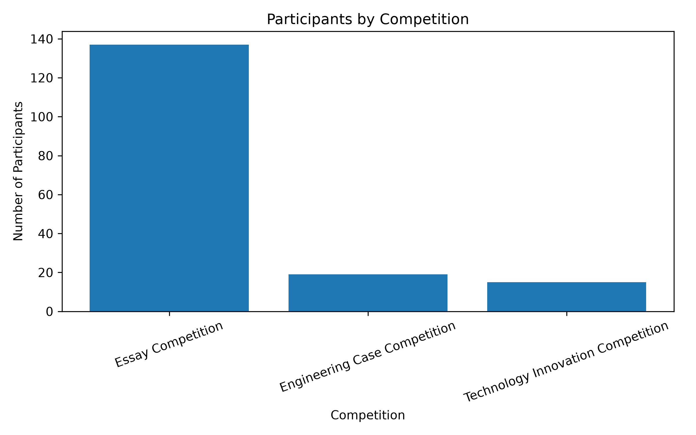
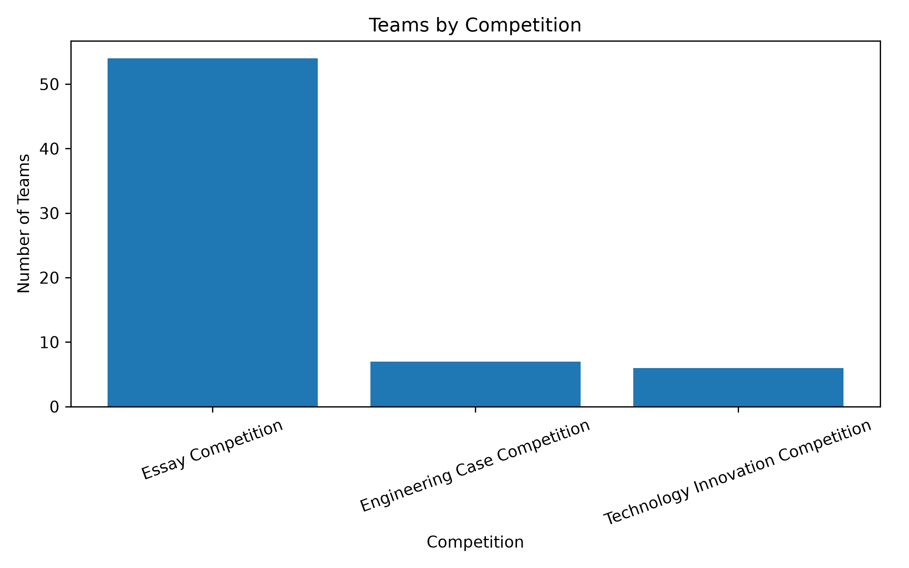
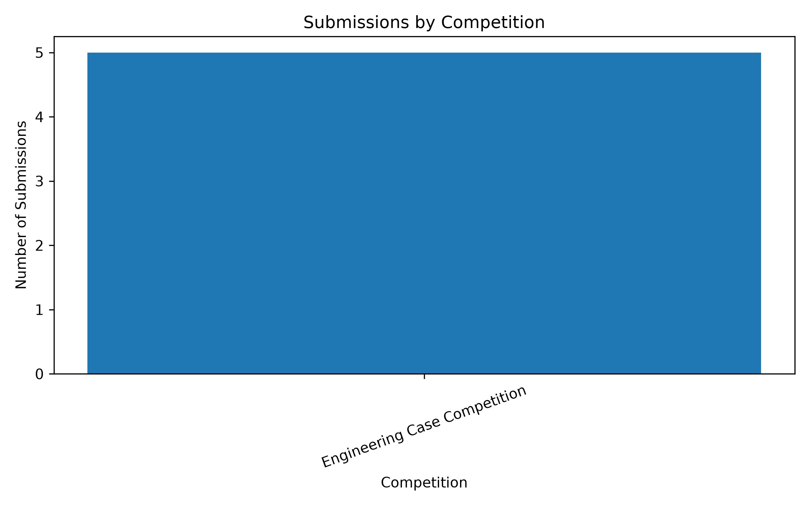

# Airnology 2026 Data Management & Governance Framework

### A Data Management and Governance Prototype for Event Operations

---

## 1. Project Overview

Airnology 2026 generates operational data from multiple sources, including registration forms, submission files, assessment spreadsheets, operational trackers, and other event documents.

The data is distributed across different spreadsheets, forms, and documents. This creates challenges related to consistency, traceability, data ownership, access control, and integration.

This project develops a prototype Data Management & Governance Framework to organize and govern selected Airnology 2026 data.

The project focuses on:

- Data Management
- Data Quality
- Data Governance
- Data Integration
- Data Lineage
- Data Classification
- Access Control

---

## 2. Objectives

The project aims to:

1. Organize Airnology operational data into a structured relational database.
2. Establish consistent data definitions.
3. Preserve registration history and resubmissions.
4. Improve data traceability.
5. Identify data quality issues.
6. Define data ownership and stewardship.
7. Establish data classification and access control principles.
8. Demonstrate a governance-oriented data architecture using real event data.

---

## 3. Data Sources

The prototype uses selected Airnology 2026 operational datasets, including:

- Registration data
- Submission data
- Assessment data
- Certificate data
- Operational trackers
- Financial records
- Marketing analytics
- Event documentation

The current database integration focuses primarily on:

**Registration → Team → Submission → Assessment → Ranking**

---

## 4. Technology Stack

| Technology | Purpose |
|---|---|
| Python | Data processing and ETL |
| Pandas | Spreadsheet processing |
| SQLite | Relational database |
| SQL | Data modeling and querying |
| VS Code | Development environment |
| Excel | Original operational data source |
| Markdown | Documentation |

---

## 5. Project Structure

```text
Airnology-Data-Governance/
│
├── data/
│   ├── raw/
│   └── processed/
│
├── database/
│   └── airnology.db  # generated locally, not tracked
│
├── analysis/
│   ├── setup_database.py
│   ├── create_tables.py
│   ├── insert_master_data.py
│   ├── load_registration.py
│   ├── import_registration.py
│   ├── insert_participants.py
│   ├── insert_submissions.py
│   ├── insert_criteria.py
│   ├── insert_assessment_ecc.py
│   ├── insert_ranking_ecc.py
│   ├── migrate_assessment.py
│   ├── data_quality_report.py
│   ├── sql_analysis.py
│   ├── visualize_data.py
│   ├── check_anomaly.py
│   ├── check_assessment_ecc.py
│   ├── check_assessment_table.py
│   ├── check_participant_duplicates.py
│   ├── check_ranking_table.py
│   ├── check_registration.py
│   ├── check_submissions.py
│   ├── inspect_assessment.py
│   ├── preview_participants.py
│   └── reset_registration.py
│
├── documentation/
│   ├── data_quality_report.md
│   ├── data_dictionary.md
│   ├── data_lineage.md
│   ├── data_classification_access_control.md
│   └── project_results.md
│
└── README.md

## 6. Key Results

| Metric | Result |
|---|---:|
| Registration Records | 77 |
| Teams | 67 |
| Participants | 171 |
| Team Members | 174 |
| Resubmission Records | 10 |
| Competition Criteria | 28 |
| Integrated Submissions | 5 |
| Assessment Records | 45 |
| Ranking Records | 5 |

The registration history is preserved so repeated submissions can be analyzed as registration versions rather than automatically treated as duplicates.

A key business rule identified in the project is:

> **Resubmission ≠ Duplicate**

Participants could resubmit their registration when correcting information because the original Google Form response could not be edited. Therefore, repeated registration records require versioning and traceability rather than automatic deletion.

## 7. Data Quality Findings

The data quality assessment identified several important issues that affect the integration and governance of Airnology operational data.

### Key Findings

- **Repeated registrations are not automatically duplicates.** Some participants resubmitted their registration to correct information because the original Google Form response could not be edited.
- **Registration versioning is needed.** Fields such as `version`, `is_latest`, and `supersedes_registration_id` can improve traceability.
- **Naming inconsistencies exist across datasets.** Differences in team names and naming formats can cause problems during exact-match integration.
- **Stable identifiers are required.** A consistent `team_id` helps connect registration, submission, assessment, and ranking records.
- **Conditional fields require contextual validation.** Missing values are not necessarily errors when certain fields only apply to specific competitions.
- **Financial data requires clearer schema separation.** Budget estimates and actual transactions should be represented separately.
- **Criterion-level assessment data should be preserved.** Storing individual scores provides better auditability than storing only the final score.

### Data Quality Dimensions

| Dimension | Finding |
|---|---|
| Completeness | Needs attention |
| Uniqueness | Needs attention |
| Consistency | Important |
| Validity | Needs attention |
| Referential Integrity | Important |
| Financial Schema | Important |

The assessment focuses on improving data reliability while preserving the original operational records and their context.

## 8. Data Management & Governance Framework

The project establishes a governance framework to clarify how Airnology data should be managed throughout its lifecycle.

### Data Ownership & Stewardship

Each major data asset is assigned a responsible owner and steward to clarify accountability.

| Data Asset | Owner | Steward |
|---|---|---|
| Registration | Lomba | Lomba |
| Submission | Lomba | Lomba |
| Finalists & Winners | Lomba | Sekretaris |
| Certificates | Sekretaris | Sekretaris |
| Committee Data | Sekretaris | Sekretaris |
| Attendance | Sekretaris | Sekretaris |
| Timeline & Tasks | Ketua | Ketua |
| Financial Data | Bendahara | Bendahara |
| Merchandise & Fundraising | Fundraising | Fundraising |
| Sponsorship | Sponsorship | Sponsorship |
| Instagram & Linktree | Kreatif/Humas | Kreatif/Humas |
| Event Rundown | Acara | Acara |

### Data Classification

The project applies four classification levels:

- **Public** — Information that can be openly shared.
- **Internal** — Information intended for Airnology internal operations.
- **Confidential** — Information containing participant or personal data requiring controlled access.
- **Restricted** — Sensitive financial or other information requiring highly limited access.

### Access Control Principle

Access is designed around the principle:

**Role → Responsibility → Data Requirement → Access Level**

Users should only access the data required to perform their responsibilities.

### Data Lineage

The primary integrated data flow is:

**Raw Data → Registration → Team → Submission → Assessment → Final Score → Ranking**

This lineage improves traceability by showing how operational records are transformed into analytical outputs.

Detailed governance documentation is available in:

- `documentation/data_dictionary.md`
- `documentation/data_lineage.md`
- `documentation/data_classification_access_control.md`

## 9. Data Architecture

The prototype uses a relational data model to connect key Airnology operational entities.

### Core Data Relationships

```text
PARTICIPANT
     │
     ▼
TEAM_MEMBER
     │
     ▼
TEAM ───────────► COMPETITION
 │
 ├──────────────► REGISTRATION
 │
 ▼
SUBMISSION
     │
     ▼
ASSESSMENT ────► CRITERION
     │
     ▼
RANKING

## 10. Analysis

The project includes analytical outputs to provide a clearer view of the integrated event data.

### Participants by Competition



### Teams by Competition



### Integrated Submissions by Competition



The analysis covers:

- Participants and teams by competition
- Registration and resubmission patterns
- Teams with multiple registration versions
- Assessment records per submission
- Derived ranking from integrated assessment data
- Database summary and data quality indicators

## 11. Documentation

The project documentation provides detailed references for the data management and governance framework.

Available documentation includes:

- **Data Quality Report** — summarizes identified data quality issues and validation findings.
- **Data Dictionary** — defines key data entities, attributes, and business terms.
- **Data Lineage** — documents the flow of data from source to analytical output.
- **Data Classification & Access Control** — defines data sensitivity levels and access principles.
- **Project Results** — summarizes the implementation and analytical outputs.

Documentation files:

```text
documentation/
├── data_quality_report.md
├── data_dictionary.md
├── data_lineage.md
├── data_classification_access_control.md
└── project_results.md

## 12. Scope & Limitations

This project is developed as a **data management and governance prototype**, not as a production information system.

### Scope

The project focuses on selected Airnology 2026 operational data, particularly:

- Registration
- Team and participant data
- Competition submissions
- Assessment data
- Ranking derivation
- Data quality
- Data governance
- Data lineage
- Data classification
- Access control

The current database integration primarily covers:

**Registration → Team → Submission → Assessment → Ranking**

Other operational datasets, including finance, marketing, logistics, and event management, were reviewed as part of the governance assessment but are not fully integrated into the relational database.

### Limitations

- The prototype uses selected Airnology 2026 datasets rather than the complete operational dataset.
- Some historical data does not contain explicit versioning or stable identifiers.
- Naming inconsistencies may affect automated data integration.
- The current assessment integration covers the available assessment dataset.
- The ranking generated by the prototype is **derived from the integrated assessment data and is not an official Airnology result**.
- The database is intended to demonstrate data management and governance concepts rather than serve as a production system.

These limitations define the boundary between the current prototype and a potential future production-grade data management system.

## 13. Portfolio Summary

This project demonstrates the application of data management and governance concepts to a real-world event context.

### Key Skills Demonstrated

- Data acquisition and processing
- Data cleaning and normalization
- Relational database design
- SQL querying and analysis
- Data quality assessment
- Registration versioning
- Data lineage
- Data ownership and stewardship
- Data classification
- Access control
- Data governance documentation

### Core Technologies

**Python · Pandas · SQL · SQLite · Excel · Markdown**

### Project Context

**Airnology 2026**  
BEM Fakultas Teknologi Maju dan Multidisiplin  
Universitas Airlangga

### Author

**Fariza Singgih**  
Data Science Student — Universitas Airlangga

GitHub: [github.com/farizlab](https://github.com/farizlab)